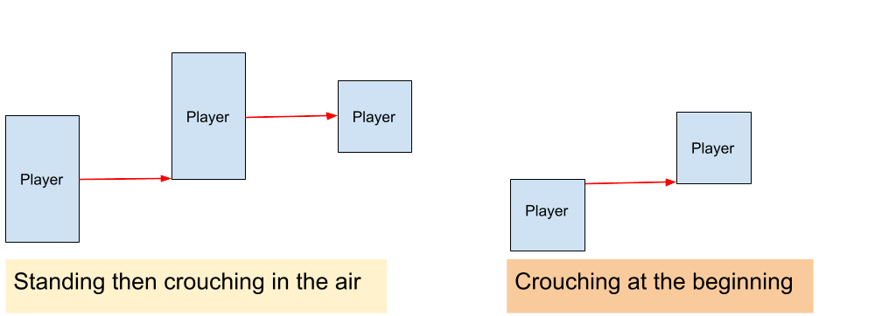
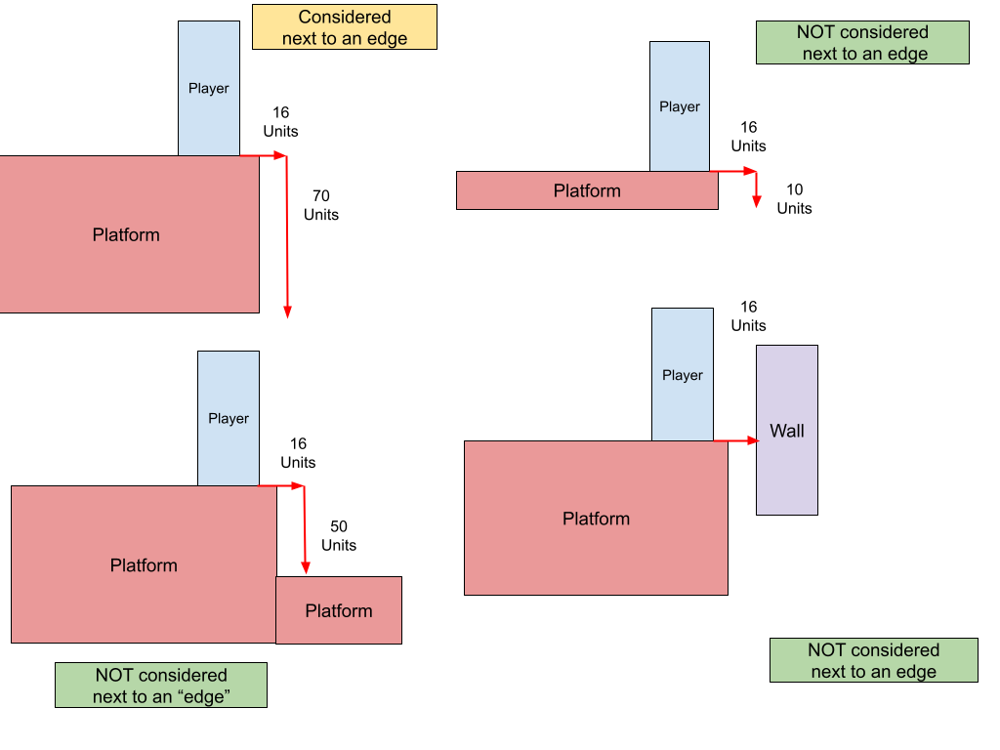

## What is Climb?

Climb, also known as **Kreedz** (KZ) in CS 1.6 and CSGO, or **Xtreme Climb** (XC) in CSS, is a popular, community gamemode found in every Counter-Strike game.  
Climb is a series of platforming challenges that can be best simplified as "trick jumps" which pull from the big 3 movement disciplines in source:  
**Strafe**, **Bunnyhop** (Bhop), and **Surf** to challenge players in scaling its maps from beginning to end.

## History of Climb

Climb started in Counter-Strike 1.1. A mapper named Kreedz decided to make a fun, mess-around map called **kz_hauntedhouse** that did not have the usual defuse objective for his friends. Kreedz named all his maps with a **kz_** tag as a sort of signature. Kreedz enjoys climbing as a hobby, so he felt that there should be some trees you could climb.  Kreedz found this aspect of the map to be particularly fun and so did others. He started making more mess-around maps with this climbing aspect sprinkled in, and eventually made **kz_giantbean** which was entirely focused on climbing and featued a built-in timer made by Kreedz. With the popularity of kz_giantbean and Kreedz making the first timer entity that could be placed into maps, Kreedz formed a community around these climb maps. Mappers would approach Kreedz to have thier maps evaluated and if it was deemed to be up to standard, Kreedz would give them the timer entity and allow it to have the **kz_** tag as a seal of approval. Even after Kreedz's departure from mapping, the popularity of these climbing maps was enough to go on to other Counter-Strike games and keep Kreedz as its namesake.
## How Climb Works

### Strafe

Strafe is the most common focus for maps. Strafing can come in the form of Long Jumps and taking indirect lines.  
**Airstrafing** works in the same way as in the Bhop and Surf gamemodes; using a strafe key (A or D) while guiding the mouse off in that direction causes the player to receive more speed.  
A **Prestrafe** is a tehcnique that has been patch out of Counter-Strike since CSGO but has been re-added for the Climb gamemode. While on the ground, players hold **both** the W and strafe keys and guide the mouse into the direction they are moving, right for W+D and left for W+A. Perfoming a prestrafe correctly will let you gain speed on the ground. Gaining speed before the jump and while in the air lets you travel futher. This is called a **Long Jump**. 
Note that since Airstrafing causes the player to deviate from their intended destination (assuming it is straight in front of them), Long Jumps typically incoroporate multiple left and right Airstrafes into a jump which counteract each other and keep the player close to a straight line. These multiple starfes in opposite directions gives the apperance of a "flicky" or "jittery" Airstrafe but a lot of practices goes into syncing the A and D keys with quick but smooth mouse movements.

Sometimes you may not be able to take a direct line due to an obstruction.  
The 2 most common forms of this is rounding a corner (often without being able to see the next platform) and 2 platforms separated by a thin wall.
In this case, air strafing is not used to gain speed but as a form of air control. The principle is the same but typically smooth turns that stay close to the wall are needed (don't bump into the wall or else you will take out all your speed and fall straight down!).  

### Bunnyhop (Bhop)

Bhop has reduced potential compared to the Bhop game mode.  
Bhopping has its own speedcap: **TBD (Momkz)**.      **380 (KZT)**,      **300 (1.6 Climb)**. The default running speed in all Climb modes is 250.  
This cap is seperate from the **maxvelocity** cap (how fast the engine lets you go before not bothering to give anymore speed 3500 by default).  
Anytime you jump the Bhop speed cap will be used meaning even if the player gained speed purely through falling or surfing,  
as soon as they try to jump off the ground with this speed, the cap will proc. If the player reaches this cap and tries to jump again,  
thier speed will be reset to:  **TBD (MomClimb)**,     **380 (KZT)**,       **240 (1.6 Climb)**. 

However this Bhop cap still allows the player to gain more speed than a Prestrafe hence, Bhopping has the potential to go further than a Long Jump. Useful to remember when dealing with diffcult Long Jumps (although this may form a bad habit if relied upon).  
Bhop jumps can also be required by the mapper by using "Bhop Blocks" that teleport you back if you try standing on them, same as the Bhop gamemode. Conversely, mappers can also add triggers that disable Bhops inside an area.  

### Surf

Surf is very similar to its game mode counterpart. All Climb modes are 100 tick while the Surf gamemode is 66 tick. This means gaining speed is quicker and losing speed is harder in Climb compared to Surf.  
Maps made with MomClimb and KZT in mind can have tradtional surf sections. The length and diffculty of these sections is entirely up to the map. Usually they are much shorter (sometimes only 1 ramp) compared to dedicated Surf maps.  
1.6 Climb has a special version of Surf called **Slide**.  
1.6 Climb has much lower airacelleration  (10aa compared to MomClimb and KZT's 100aa). This means players can't as easily flick onto a ramp ("board") and genearate speed, or flick off a ramp and generate height.    
Because of this "Slide" sections are usually brief and focus on keeping on the board rather than gaining enough speed to fly off.

Remember that in any movement mode you can always slide up gentle slopes with just 'W' while looking at the slope!

### Stamina (Jump-Land Penalty) [1.6 Climb Only]

Any time the player jumps (not when they are in the air for any other reason such as falling off something) a timer starts for about 1.31 seconds.
Whenever the player lands, they will be slowed for however much time is left on the timer.
For reference, if a player jumps and lands on flat ground about 0.66 seconds or about half the time is taken.
This means that jumping up to something slows you down longer since you land earlier. And jumping to something beneath will slow you less or not at all.
For speedrunning getting around this stamnia is a top prority for optimzing runs. For completion players only certain types of platforms make stamina a cause for concern namely ones that are to small or awkward to get a running start from a standsill.
[This doc goes into futher detail](https://kzguide.gitlab.io/techniques/stamina/).

### Advanced Techniques 

Climb has some techniques of its own rarely seen outside of its gamemode.

**Fast Ladder Climbing**: Ladders can be climbed by "walking into them". If you are directly facing the ladder hold W, if sideways A/D. If you face the ladder diagonally you can climb the ladder both ways. If you hold W and A/D the speeds add onto each other resulting in a much faster climb.    

**Ladder Jumps**: The speed you gain from fast ladder climbing is enough to fling you into the air! This technique does not have anything to do with inputting jump (which just pushes you off the ladder) and is more simillar to surfing. Gain speed with the climb and flick off near the top. Just like surfing, the way you flick off dictactes your trajectory, and whether you trade speed for height and vice versa.  

**Crouch Bhops**: Bhopping starting in a crouch position. It may be required in a map when going underneath a low celling. Doing a normal Bhop and crouching in the air will raise your collision box (you tuck in your legs), so to go underneath a hazard you must start the Bhop crounched and usually stay crouched.    
Crouching will also limit your ablity to turn in the air and thus gain speed as well. This speed disadvantage is negated if you have already reached the Bhop speedcap on KZT since you will remain at 380 regardless of how much speed you try to gain.  

**Standups**: While in the air, if you crouch close enough to the ground (TODO: get exact units) the engine will not let you uncrouch since you'll clip into the floor, instead it waits until the moment you've hit the ground or more space has opened up beneath you and uncrouches. This behavior gives you a nice grace period to execute a frame-perfect. (or tick-perfect) outcome. (Note that the faster you are falling, the shorter the grace period is).  

**Standup Bhops**: Combines Standups with bhoping, the idea is that the best of both worlds is that you perfectly time and hold your crouch so that you only "tuck your legs" to get the extra distance. Sounds like a tall order but thanks to how "Standups" behave, to get the best outcome you only have to time the beginning of the crouch to be inside this window and the engine does the rest of the timing. This is not a replacement for regular Bhops or Crouch Bhops, since you may prefer to land sooner and jump sooner or need to aviod map hazards. Standup Bhops are only for squeezing extra distance out of a jump in an optimal manner. 

**Double Duck [1.6 Climb only]**: In 1.6 Climb, while on the ground pressing duck and releasing it before you are fully on the ground will cause the game to unduck you prematurely, the result is that you pop 18 units off the ground (very small compared to a jump) you can improve this height by crouching again in the air resulting in being 36 units off the ground (better but still small compared to a jump).  
you can use Double Ducks to climb small humps without wasting time overshooting with a jump, but in addition to this they have 1 big advantage over jumps:
**ducking is not considered a jump so the jump-land penalty does not proc.**  
This means you can gain speed with air strafing without worrying about slowing down upon landing. This is the used in Count Jumps.   

**Count Jump [1.6 Climb only]**: Done by first gaining speed with a prestrafe than double ducking to gain more speed in the air, land then finally jump. It can also be used in a Bhop sequence where doing another jump would result in over/under shooting the next platform, in this case the double duck is used as a "mini-jump" in the sequence and most be timed just like a Bhop with the first tap of duck being right as you land and the second tap being right after. This is also sometimes called a **Count Jump**. 

**Duck Roll [1.6 Climb only]**: Sometimes called Silent Walking, Russian Walking, or G-strafe in Counter-Strike, Duck Roll is its given name in Half-life so for consistency's sake It will be called Duck Roll.  
It is possible to do a "Bhop" sequence comprised entirely of Double Ducks. This lets you get pass the Bhop speed cap since it is not considered a jump. It is very hard to maintain Duck Rolls given how much more frequent you must duck compared to jumps in a Bhop sequence. Duck Rolls are vertically limited, so even with more speed they may not reach a place a Bhop can. DuckRoll's effectivness heavily depends on the map.  

**High Jump [1.6 Climb only]**: In Source and Goldsrc there exists a property called **edge friction** it decides what factor that "normal" friction will be multiplied by when a player is close to an edge. If it is set higher than 1, you will slow down every time you try to jump from the edge of a platform. These are the edge frictions for each Climb mode:  **TBD (MomClimb)**,     **1 (KZT)**,       **2 (1.6 Climb)**.  
**[Notice that 1.6 Climb is the only Climb mode whose edge friction is diffrent than the normal friction]**.  
You are considered to be next to an edge if both of these conditions are true:   
**1. In the direction you are moving (not facing), an "invisible line" 16 units in front of the bottom-center of your collision box (your feet) does not intersect with anything solid**.  
**3. From the end of that 16 unit invisible line, another 70 units (52 units if crouched) invisble line pointing down does not insersect with anything solid**.  
[For refrenece, player height is 72 units]. 
  
you can still "trick" the game into thinking you are not next to an edge even when you are on a high up platform. Remember the engine only checks in the direction you are moving, so if you are moving in a direction that does not intersect with a platform's edge you are not considered "next to an edge" regardless of how close you actually are to it. We can use this to maintain a normal speed. High Jumps are typically done by moving perpendicular to the edge you want to jump from while sticking very close it, and then only turning towards the edge for your pre-strafe. This minimizes the amount of time you are slowed down due to edge friction while still gaining some speed from the pre-strafe. The shape of the platform plays a big role in High Jumps, a small square platform can't really be taken advantage of by this trick. 

**Comboing**: More of a general term, this describes chaining jumps together in a fluid motion, which just like in fighting games, is not obligatory for casual play but is a cornerstone skill built off of the fundamentals and is required to be competitive. 
